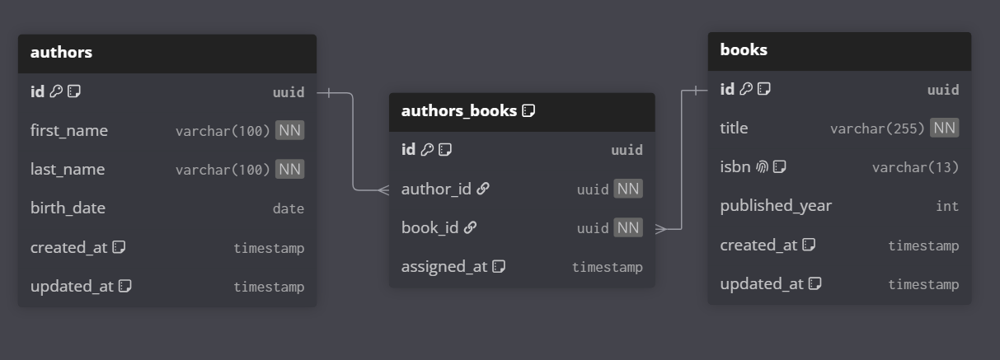

# Books-Authors Microservice

This microservice handles the management of Authors, Books, and their intermediate many-to-many relationships (`AuthorsBooks`). It is built using NestJS, CQRS, and communicates with other services using Kafka.

---

## 🏗️ Architecture Design

### 1. CQRS (Command Query Responsibility Segregation)
The microservice implements a strict CQRS pattern using NestJS `@nestjs/cqrs` to separate write operations from read operations:
- **Commands (Write Lifecycle)**:
  - Invoked for write events (e.g. `CREATE`, `UPDATE`, `DELETE`).
  - Dispatched via `CommandBus`.
  - Execute business logic using Domain Aggregates and Factories, producing domain events (e.g., `AuthorCreatedEvent`, `AuthorsBooksCreatedEvent`).
  - Save changes to the **Write Master Database**.
- **Queries (Read Lifecycle)**:
  - Invoked for read actions (e.g., paginated searching, getting by ID).
  - Dispatched via `QueryBus`.
  - Directly query the **Read Replica Database** to reduce load on the master node.

### 2. Read-Replica Synchronization (`ReadDbSyncService`)
To enable horizontal read scaling:
- The system connects to two database configurations: `database` (Write Database) and `databaseRead` (Read Replica Database).
- At startup, the [ReadDbSyncService](file:///c:/projects/NestJs/template-backend/books-authors-template/src/common/services/read-db-sync.service.ts) performs an automated synchronization check:
  - Validates and creates missing table structures, ENUM types, and secondary indexes on the Read database to match the Write database.
  - Automatically updates any schema changes (e.g. modified column types, defaults, nullable fields).
  - Performs initial sync and cleanups of data between databases.
- At runtime, query handlers retrieve data from the `'read'` replica connection using:
  ```typescript
  @InjectRepository(Entity, 'read')
  ```

---

## 📊 Database Schema

Below is the Entity-Relationship Diagram (ERD) representing the database schema:



---

## 📁 Directory Structure

```
src/
├── common/                  # Shared filters, interceptors, and Database Syncer
│   ├── interceptors/        # Kafka response wrapper interceptors
│   └── services/            # ReadDbSyncService
└── modules/                 # Application Modules (Authors, Books, Authors-Books)
    └── [module-name]/
        ├── application/
        │   ├── command/     # CQRS Write Commands & Handlers
        │   ├── dto/         # Request input validation DTOs
        │   └── query/       # CQRS Read Queries & Handlers
        ├── domain/          # Domain aggregates, factories, and events
        └── infrastructure/
            ├── controllers/ # Kafka Message pattern controllers
            ├── entities/    # TypeORM Database entities
            └── utils/       # Microservice Kafka topic definitions
```

---

## 📡 Message Patterns & CQRS Mappings

### ✍️ Commands (Writes)
| Kafka Topic | DTO / Payload | Command Class | Action |
|---|---|---|---|
| `author.create` | `CreateAuthorDto` | `CreateAuthorCommand` | Creates a new author |
| `author.update` | `UpdateAuthorDto` | `UpdateAuthorCommand` | Updates an author's metadata |
| `author.delete` | `deleteAuthorDto` | `DeleteAuthorCommand` | Deletes an author |
| `book.create` | `createBookDto` | `CreateBookCommand` | Creates a new book |
| `book.update` | `UpdateBookDto` | `UpdateBookCommand` | Updates a book's metadata |
| `book.delete` | `DeleteBookDto` | `DeleteBookCommand` | Deletes a book |
| `authorBook.assign` | `AssignAuthorBookDto` | `AssignAuthorBookCommand` | Assigns an author to a book |
| `authorBook.unassign` | `UnassignAuthorBookDto` | `UnassignAuthorBookCommand` | Unassigns an author from a book |

### 🔍 Queries (Reads from Replica Connection)
| Kafka Topic | Query Payload | Query Class | Action / Response |
|---|---|---|---|
| `author.getAll` | `GetAllAuthorsDto` | `GetAllAuthorsQuery` | List authors (paginated & filtered by `firstName`, `lastName`, `birthDate`) |
| `author.get` | `GetAuthorDto` | `GetAuthorQuery` | Retrieve author by ID, returns loaded `books` array |
| `book.getAll` | `GetAllBooksDto` | `GetAllBooksQuery` | List books (paginated & filtered by `title`, `isbn`, `publishedYear`) |
| `book.get` | `GetBookDto` | `GetBookQuery` | Retrieve book by ID, returns loaded `authors` array |

---

## 🛠️ Developer Guide: Implementing a New CQRS Feature

When adding a new entity or feature:

1. **Entity**: Define write entities in `infrastructure/entities/`.
2. **DTO**: Create input schemas in `application/dto/`.
3. **Write Path (Commands)**:
   - Create domain events in `domain/events/`.
   - Create an Aggregate Root in `domain/aggregates/` extending `AggregateRoot`.
   - Create a Factory in `domain/factories/` to instantiate and convert between aggregate/entity.
   - Create Command & Handlers in `application/command/`.
4. **Read Path (Queries)**:
   - Create Query & Handlers in `application/query/`.
   - Inject the `'read'` repository to retrieve data from the replica:
     ```typescript
     constructor(
         @InjectRepository(Entity, 'read')
         private readonly repository: Repository<Entity>,
     ) {}
     ```
5. **Module Setup**: Register both write and read repositories in your NestJS module:
   ```typescript
   @Module({
     imports: [
       CqrsModule,
       TypeOrmModule.forFeature([Entity]),         // Write Repository injection
       TypeOrmModule.forFeature([Entity], 'read'), // Read Replica Repository injection
     ],
     ...
   })
   ```

---

## 🚀 Running the Project

1. Install dependencies:
   ```bash
   pnpm install
   ```
2. Start in watch mode:
   ```bash
   pnpm run start:dev
   ```
